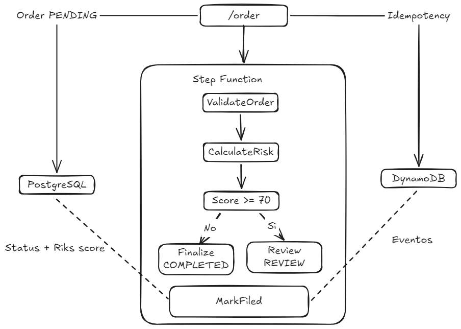

# Arquitectura

La API dispara el workflow, y tanto la API como las tres Lambdas leen/escriben en PostgreSQL y DynamoDB. Las líneas punteadas resumen que los estados de finalización actualizan el status y risk_score en Postgres y registran eventos en Dynamo.

